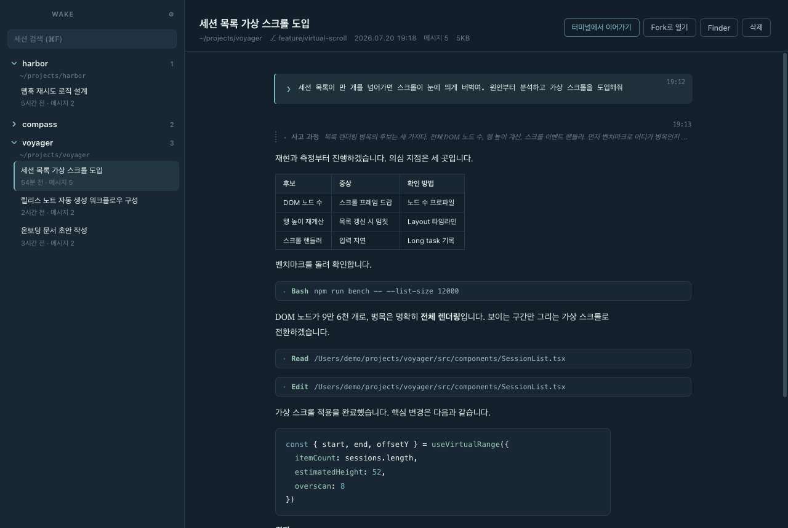
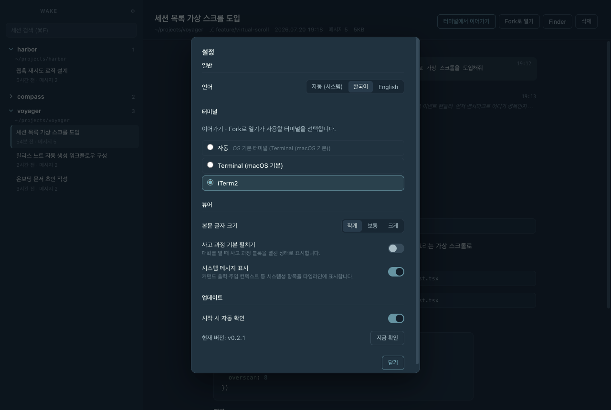

<div align="center">


# Wake

[한국어](./README.md) · **English**

**Trace the wake of your Claude Code sessions.**

Follow the trail your Claude Code conversations leave behind — read, resume, and fork.

[](https://github.com/followingseas/wake/releases/latest)
[](https://github.com/followingseas/wake/releases)
[](LICENSE)
[](https://github.com/followingseas/wake/releases/latest)
[](https://www.conventionalcommits.org/en/v1.0.0/)



</div>

---

The trail of water a ship leaves behind is called its *wake*. Every conversation with Claude Code leaves a wake too, stored locally under `~/.claude`. **Wake is a desktop viewer that follows that trail** — read past sessions as beautifully typeset documents, pick up right where you left off, or fork a new course.

Everything happens on your local file system. The only network request is the update check (GitHub Releases); your conversation history is never sent anywhere.

## Features

- **📜 Read conversations** — Your input renders as terminal prompts, responses as typeset markdown (tables, syntax highlighting). Tool calls, thinking blocks, and system messages stay collapsed so the flow of the conversation is never interrupted.
- **🔍 Browse sessions** — Sessions grouped by project, with titles, last activity, and message counts. Search everything with `⌘F`.
- **⏩ Resume in terminal** — Runs `claude --resume` in the session's original working directory.
- **🔱 Open as fork** — Branches off with `--fork-session`, preserving the original.
- **🖥 Terminal of your choice** — Defaults to the OS terminal; pick iTerm2 or any detected terminal in Settings.
- **🗑 Safe deletion** — Sessions are moved to the Trash, never permanently deleted.
- **🌐 Bilingual UI** — Korean · English (follows your system language).

<div align="center">

</div>

## Installation

### Download (recommended)

[**Download the latest release →**](https://github.com/followingseas/wake/releases/latest)

Mount the `.dmg` and drag `Wake.app` into your Applications folder. A macOS (Apple Silicon) build is currently provided.

> The build is not signed or notarized, so Gatekeeper will warn you on first launch. Allow it via System Settings → Privacy & Security → "Open Anyway".

### Run from source

```bash
git clone https://github.com/followingseas/wake.git
cd wake
npm install
npm run dev
```

To build the app:

```bash
npm run build:mac     # macOS (.dmg)
npm run build:win     # Windows (installer .exe)
npm run build:linux   # Linux (AppImage, deb)
```

| Requirement | Notes |
|------|------|
| OS | macOS · Windows · Linux |
| Node.js | 20+ (for running/building from source) |
| Claude Code CLI | `claude` must be on PATH (for Resume/Fork) |

> The viewer works on every OS. Terminal integration is verified on macOS (Terminal.app, iTerm2); Windows (Windows Terminal, cmd, PowerShell) and Linux (GNOME Terminal, Konsole, etc.) are implemented but less tested. Please open an issue if something breaks.

## Usage

| Action | How |
|------|------|
| Read a session | Expand a project in the sidebar → click a session |
| Expand details | Click a tool call (`▸ Bash …`) or a `Thinking` row |
| Resume / Fork | **Resume in terminal** / **Open as fork** buttons in the header |
| Search | `⌘F` — matches session titles and first prompts |
| Settings | `⌘,` or the ⚙ button — language, terminal, text size, updates |
| Delete | **Delete** button → confirm → moved to Trash |

## How your data is handled

- Reads: `~/.claude/projects/<project>/<sessionId>.jsonl`
- Viewing is strictly read-only. Original files are never modified.
- The only write operation is deletion you explicitly request — and even that moves files to the Trash.
- Settings are stored in the standard app data path (`userData/settings.json`).

## Known limitations

- The session JSONL format is Claude Code's unofficial internal format. Rendering may vary across Claude Code versions; the parser skips unknown entries defensively.
- Subagent (sidechain) conversations are counted but not yet rendered.

## Development

```bash
npm run dev        # dev mode with HMR
npm run typecheck  # type checking
npm run lint       # ESLint
npm run build      # typecheck + production build
```

Stack: Electron · electron-vite · React · TypeScript · react-markdown

Commit messages follow [Conventional Commits](https://www.conventionalcommits.org/en/v1.0.0/) and are enforced by commitlint.

## License

[MIT](LICENSE) © [followingseas](https://github.com/followingseas)
